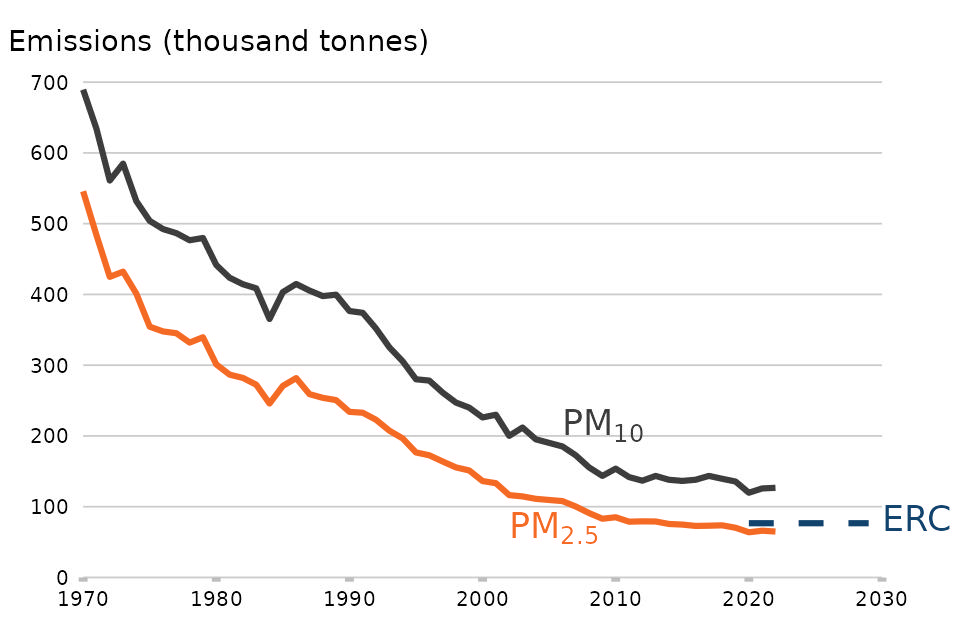
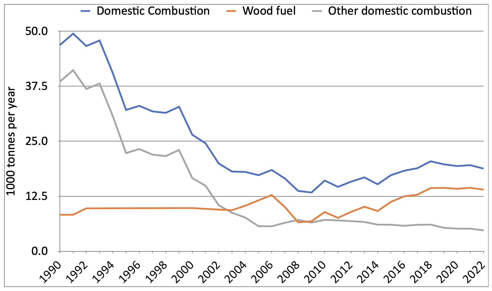

# Falling PM2.5 and the future of firewood

There's a lot of talk recently about the future of firewood as a fuel source
in people's home. Some pressure groups are calling for less wood burning,
but here we explain how technological advances by stove manufacturers allow
for a large increase in firewood burning at the same time as huge decreases
in pollution.

The February 2024 edition of DEFRA's 
[Emissions of air pollutants in the UK – Particulate matter (PM10 and PM2.5)](https://www.gov.uk/government/statistics/emissions-of-air-pollutants/emissions-of-air-pollutants-in-the-uk-particulate-matter-pm10-and-pm25)
provides the most recent survey of the topic in the UK. PM2.5 are solid 
particles of human pollution and natural dusts like sea salt less than 
2.5 micrometres in size.

This graph shows how annual UK emissions from all sources 
of PM2.5 have decreased by 88%
between 1970 and 2022, and they have continued to fall. The PM2.5 reduction
target of the National Emission Ceilings Regulations (2018) was already met
in 2020, way ahead of the deadline of 2029. 

If we just look at domestic emissions of PM2.5, we can see the same pattern.
Domestic emissions include garden bonfires, outdoor barbecues, and things
like chimineas. But the major change has been due to people moving away from
coal fires. It's not clear how big the errors are in these estimates as they
go up and down from year to year, but we can at least see the trend. 

In 2008 and 2009, there was as much PM2.5 from wood as other sources, but
after that wood started to climb until 2018. Probably some of this is due to
people switching from coal, but publicity around climate change encouraged
the new installations of stoves burning wood. As our Felling License 
regulations impose strict restocking and replanting requirements, British 
firewood is almost all sustainable and carbon neutral.

In 2007 the financial crisis
became visible in the UK with the collapse of Northern Rock and it turned
into a full blown recession followed by austerity. So saving money by moving
to wood burning became an additional reason to switch. You can see this
happening in the rising PM2.5 numbers from wood burning. 

However the industry was keen to answer concerns about PM2.5 emissions and
voluntarily promoted certification of stoves with lower emissions. Since
sooty emissions consist of unburnt, wasted carbon and manufacturers compete
with each other on efficiency, they're optimising stoves in that direction
anyway. You can see the results from 2018 onwards, as total PM2.5 emissions
from domestic wood burning gradually falls despite continued strong sales 
of new woodstoves. By 2022 we were back down to 14,000 tonnes of PM2.5 from
domestic burning of woodfuel.

Where do things stand now in the mid 2020s? In the smoke controlled zones in
most urban areas, wood can only be burned in DEFRA exempt woodstoves which
have been independently assessed. This rules out open fires and older
stoves. In England, only properly seasoned firewood can be sold in
quantities of less than two cubic metres. 
Only stoves meeting the tighter Ecodesign regulations can be
instaled and it's a measure of the industry's focus on efficiency and
cutting emissions that the regulations mandate less than 3g/hr of PM2.5 but 
[on average Ecodesign stoves have been measured to emit only 0.72g/hr](https://stoveindustryassociation.org/sia-responds-to-wood-burning-stove-and-hgv-emission-comparison/).

Since they are easily surpassing the regualations, the industry has created
the voluntary Clearskies scheme. The level 5 Clearskies stoves on sale have
to emit only 0.55g/hr of PM2.5. 

To think about where things are going, we need to look at how much people
use stoves and how many there are. Research for DEFRA undertaken by Kantar and 
[published in 2020](https://sciencesearch.defra.gov.uk/ProjectDetails?ProjectID=20159&FromSearch=Y&Publisher=1&SearchText=AQ1017&SortString=ProjectCode&SortOrder=Asc&Paging=10) 
gives us some numbers to work with. Their 
"Annexe A - UK domestic solid fuels use estimates paper" is the most useful
part. 

First, 2.1 million
homes use wood fuel of some form, but 42% of the burning time is actualy 
outdoors - barbecues, chimineas etc. 
They estimate that on average households doing indoor burning (woodstoves and
open hearths) burn for 942 hours per year. They get a total of 657 million
hours of indoor burning for the whole country, which gives 698,000
"average" households. Clearly some use more and some less than the average,
and so the number doing any indoor burning will be higher than this.

There are 14,000 tonnes of PM2.5 from domestic wood burning each year, and 
if we assume indoor and outdoor sources have roughly the same PM2.5/hour
rates, then about 8,120 tonnes (58%) will be from indoor burning. Outdoor
burning does involve some quite inefficient open fires with higher PM2.5
rates, but also dry charcoal which is very clean once it gets going. So our
assumption has swings and roundabouts.

How many stoves does that correspond to?
As people gradually upgrade and replace old stoves and open fires with
woodstoves like the Clearskies 5 certified models, what happens?

Well if we divide 8,120 tonnes of PM2.5 by 0.55g/hr we get 14.8 billion
hours. Billion. So that's 22 times more than the 657 million hours we 
currently have indoors. In other
words, we could increase the number of households with indoor heating from 
firewood from about a million to above 22 million, without any increase in 
PM2.5 emissions just by people upgrading and replacing with Clearskies 5 
woodstoves!

Now, there's no way we could supply enough British firewood to cover that,
and it would involve sucking in imported firewood some of which isn't
sustaintable or carbon neutral. However, the lesson is that growth in
woodstoves is not limited by national PM2.5 targets. 

So we have a lot of elbow room. 
**Let's imagine the number of homes using woodfuel
indoors *quadruples* in parallel to fully transitioning to Clearskies 5 
woodstoves. That would result in PM2.5 emissions from indoor wood burning 
*falling* to only 18% of the current level.**
